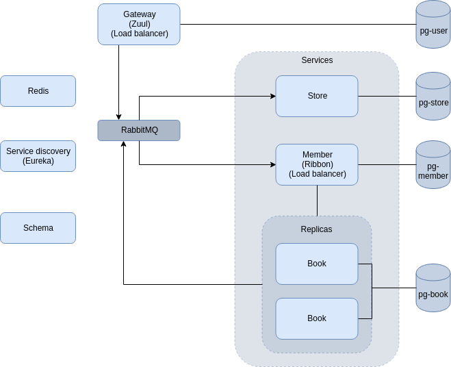

# PG6100 Bookstore exam
### Repository
[Link to repository](https://github.com/stellaselena/PG6100-bookexam)  

### Postman
POSTMAN collection to import: [https://www.getpostman.com/collections/b4e7f0ff91abcadf453f](https://www.getpostman.com/collections/b4e7f0ff91abcadf453f)  

### Travis

## About the application:
The topic of the application is trading of used books in an university.

All APIs provide POST, PUT, PATCH, GET and DELETE methods.

PUT, POST and PATCH methods that are routed through Zuul are secured from XSRF attacks, as shown in E2E.

Each module is protected by Spring Security, where Redis is used as a shared storage for authentication data.

#### University library (Book module)
Those who work in the library (assuming that they have ADMIN role) have access to upload new books, edit or delete existing books. 

After registering, members (students of the university) are able to browse the books that the university library owns, where they can
view description, genre, author, and the retail price of the books.

##### Security:
Only a library admin is able to create and modify books.
Registered members can view books owned by the library.

#### Students (Member module)
When a user is registered, a member profile is created for the given user. This is done using AMQP (RabbitMQ).

If a member owns his/her own copy of the book they are able to do so in two ways:

1. If a member wishes to sell a book via university library, only if the library has the book 
listed can a member can specify that he has a copy of the given book.
After notifying the library, the copy of the book with the price specified by the member will be posted to the book store
where students can sell their copies.

2. If they want to put a book for sale that the university library doesn't own, they can do so directly from the store.

##### Security:
Registered members can modify their profile information and the books that they wish to sell, but they cannot
modify info of other members or specify books that they are selling.

#### Bookstore (Store module)
From the bookstore, members (students) can see all books that are posted for sale by other students.
A member is able to retrieve the list of books that are sold by other students.
A member can filter the books by their name, by the name of the seller or by their price.
Books can also be filtered by the last 10 events in which a member registers the fact that he wants to sell a book.
Book module communicates with store module using AMQP (RabbitMq). Store module subscribes to the queue containing
new entries to be inserted into the DB of the store module.

##### Security:
Registered members can modify the information of the books that they have posted for sale, such as their price,
 but they cannot modify the books that are sold by other students.
 
#### Schema
 Schema module is used to expose DTOs, in order to avoid dependencies whenever possible.

## How to UP the application
1. `mvn clean install` (`-DskipTests` to skip the tests)  
2. `docker-compose build`  
3. Run `docker-compose up -d` 
4. (Optional) `docker-compose logs -f` to get all logs

Up time depends on hardware (in my case it takes around 1-2 minutes)

## How to test the application
1. Run `mvn clean install` (add -DskipTests if you do not want to run tests)
2. Run `docker-compose build`
3. Run `docker-compose up`
3. Use the above provided Postman collection to manually test the endpoints.
4. To run integration tests: `mvn clean install -DskipIntegrationTests=false` (disabled by default)

### How is the application implemented and technologies used
  

- Gateway uses Zuul for load balancing and proxying. THe gateway stores user credentials and is used for authentication, via Redis.
- Redis is used to store distributed session.  
- Eureka is used for service discovery (Dotted lines are showing the service discovery with Eureka)
- Ribbon is used for load balancing.
- RabbitMQ is used for message delivery (Books for sale persistence to store and create a member when a user is created)
- Postgres for databases (H2 for local)
- Hystrix to handle service downtime

Spring framework, in addition to some other libraries is used for testing and production.

**Production**: Docker, Docker-compose, Netfix stack (Zuul, Eureka, Ribbon), Hystrix, RabbitMq, Redis and Postgres.

**End to End Tests**: Testcontainers library for running Docker and Docker-Compose fir end-to-end tests.

**Isolated Tests**:  RestAssured and Wiremock to mock other modules.

### End-to-End
* Authentication tests are covered in **AuthFeatureIT**
* E2e tests for modules can be found in **ModulesIT**
    * Each endpoint contains at least one test. Refer to the code for comments with description of each test.
    * These will also in itself act as a test proving that Zuul, Eureka and RabbitMq work.

It will take a couple of minutes to start up all the services, partly because of all the containers that are started and
partly because eureka takes some time to get all instances registered. 

### Documentation for APIs (SWAGGER)
- Manual start: 
It is possible to manually start endpoints by running them directly from IDE. In this case all endpoints
will have different ports, which are configured inside application.yml for each API.
Swagger documentation will then be available from `localhost:${port}/swagger-ui.html`. Ports: Member API: `8081`, Book API: `8082`, Store API: `8083`

- Via docker-compose:
Swagger documentation will be available from localhost:10000/api/v1/${module_name}/swagger-ui.html for authenticated users.
To authenticate, use Postman to create credentials, and use them in browser.

## Docker
If problems such as nodes crashing arise, keep in mind that it is important to increase the memory Docker is allowed to use.
To remove all images: `docker rmi $(docker images -a -q)`

## Eureka
To view Eurekas dashboard and services registered, uncomment Eureka's port in docker-compose.yml, dashboard will be accessible from `localhost:8761`

## Extra features/ Difficulties
